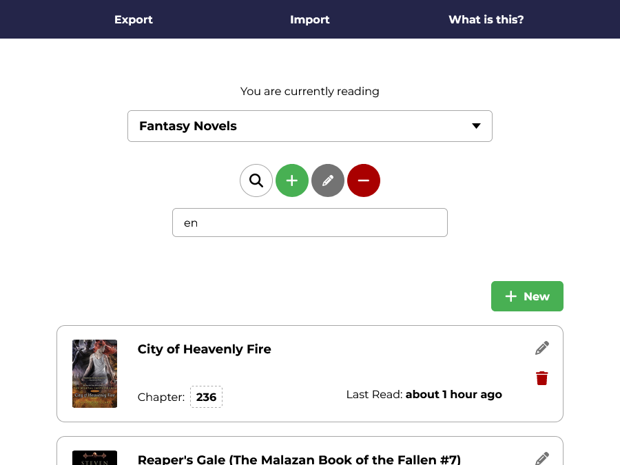
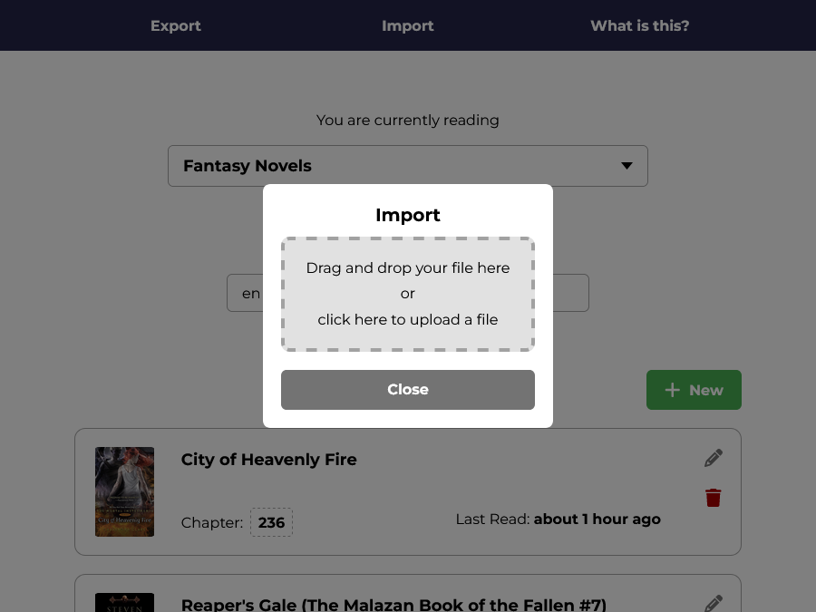
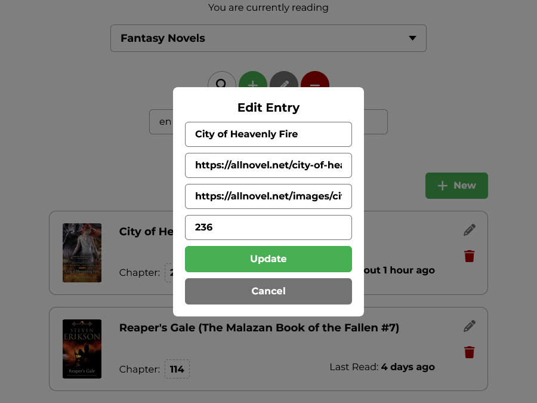
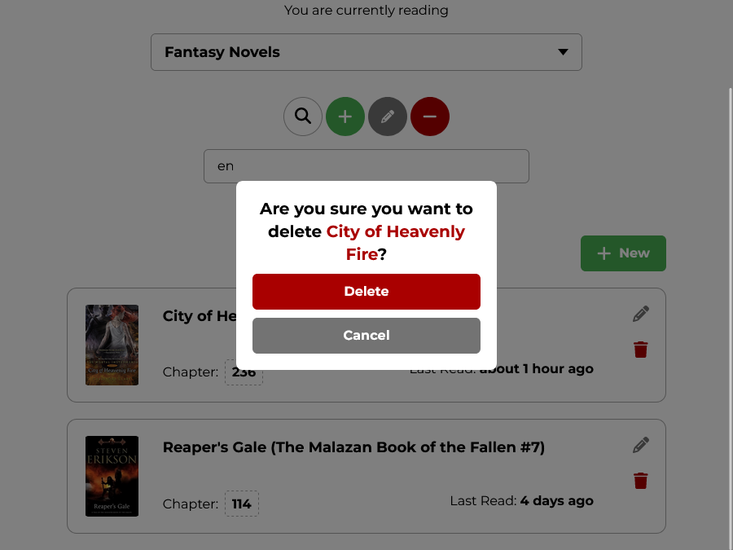
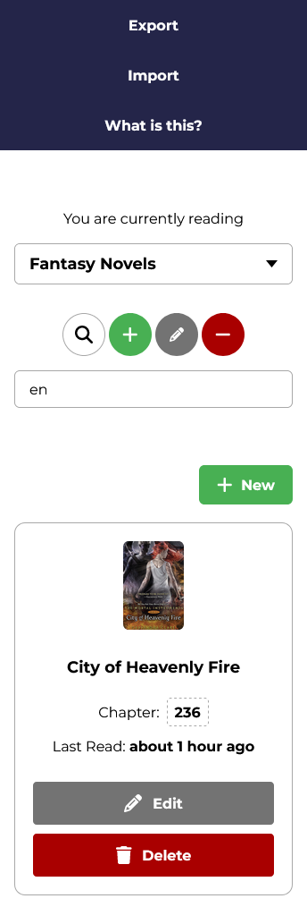

# Libro List

Libro List is a book tracker app that allows you to create and edit multiple lists for books, manga, anime, tv shows, or anything else that can be labelled numerically. Similar apps require you to navigate with a mouse, type on a keyboard to update your tracked books, and click on several buttons. But LibroList includes keyboard shortcuts that allow you to navigate and update your lists blazingly fast, which means you'll spend less time updating your lists and more time reading.

The keyboard shortcuts are as follows:
- **h** - decrease the chapter number by 1.
- **j** - navigate to the next book.
- **k** - navigate to the previous book.
- **l** - increase the chapter number by 1.

This app was built as part of the [#10DayWebBuild](https://10daywebbuild.netlify.app/) challenge.

## Features

- Tracks the last time you viewed each book.
- VIM-style keyboard shortcuts to navigate between books and update chapters.
- Search lists with partial-word matching.
- Lists are saved in your browser. No sign-up needed.
- Import and export your saved lists.
- Responsive and mobile-friendly design.


## Screenshots









## Instructions

PNPM:
```bash
  pnpm install
  pnpm run dev
```

NPM:
```bash
  pnpm install
  pnpm run dev
```
    